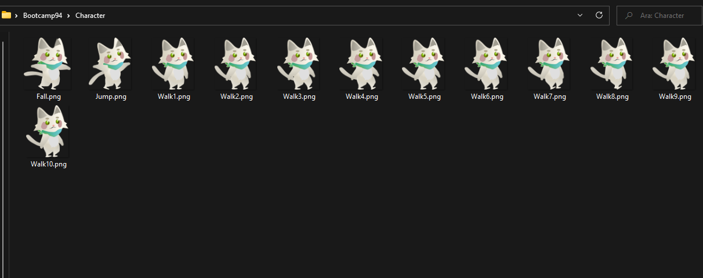
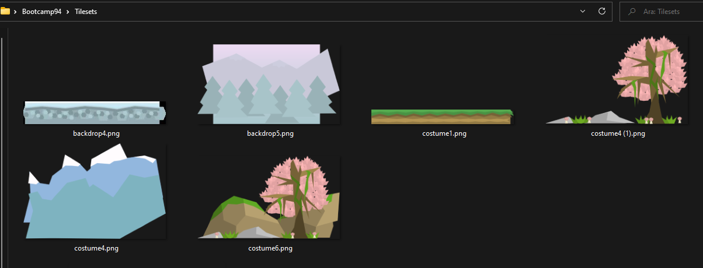

# **Takım İsmi**

bootcamp94

# Ürün İle İlgili Bilgiler

Ürün 2D bir platform oyunu olacaktır.

## Takım Elemanları

- Türkü Karakuş: Product Owner
- Suzan Sezgin: Scrum Master
- Berkay Kalender: Team Member/Developer
- Eydi Gözeneli: Team Member/Developer

## Ürün İsmi

-- Catio

## Ürün Açıklaması

- Oyun 2D bir platform oyunu olacaktır. Karakterin levelleri geçmesi mantığı üzerine kurulacaktır. Ayrıa levelleri geçerken  enemyler ile savaşılacak ve mama toplanaacaktır. Level sonunda topladığı mamaya göre yıldız kazanacaktır.

## Ürün Özellikleri

- Gittikçe zorlaşan leveller
- Nesne toplama
- Enemy saldırıları
- Boss leveller

## Hedef Kitle

- Oyun oynamayı seven herkes

## Product Backlog URL

[itco](https://app.clickup.com/4514905/v/li/204119291)

---

# Sprint 1

- **Sprint Notları**: User Story'ler product backlog'ların içine yazılmıştır. Product backlog item'lara tıklandığında hikayelerin detayları okunabilir.

- **Sprint içinde tamamlanması tahmin edilen puan**: 100 Puan

- **Puan tamamlama mantığı**: Toplamda proje boyunca tamamlanması gereken 380 puanlık backlog bulunmaktadır. 3 sprint'e bölündüğünde ilk sprint'in en azından 100 ile başlaması gerektiğine karar verildi.

- **Backlog düzeni ve Story seçimleri**: Backlog'umuz ilk yapılacak story'lere göre düzenlenmiştir. Sprint başına tahmin edilen puan sayısını geçmeyecek şekilde sıradan seçimler yapılmaktadır. Story başına çıkan tahmin puanı, toplam puanın yarısından az tutulmuştur. 

- **Daily Scrum**: Daily Scrum toplantılarının zamansal sebeplerden ötürü Slack üzerinden yapılmasına karar verilmiştir. Daily Scrum toplantısı örneği jpeg veya word olarak Readme'de tarafımızdan paylaşılmaktadır: [Sprint 1 Daily Scrum Chats](https://github.com/w3eydi/bootcamp94/blob/sprint/img/Sprint/DailyScrumMeetingNotesSprint1.docx)

- **Sprint board update**: Sprint board screenshotları: 
 
 

- **Ürün Durumu**: Ekran görüntüleri:
  
  
  
  

- **Sprint Review**: 
Alınan kararlar: Oyun için ön hazırlıklar başlamıştır. Assetlerin tasarımına başlanacak ayrıca bölüm tasarımı ve ile ilgili genel konsept oluşturulacaktır. Ayrıca UI için taslaklar oluşturulacaktır. Playerın hareket logici oluşturulmaya başlanacaktır.  Sprint Review katılımcıları: Tüm takım katılım sağlamıştır.

- **Sprint Retrospective:**
  - Takım içindeki görev dağılımıyla ilgili düzenleme yapılması kararı alınmıştır
  - Tahmin puanları gözden geçirilmeli ve sprint planlama toplantılarında gerekli geri bildirimlerin developer'lar tarafından verildiğine emin olunmalı
 

-**Diğer Notlar**:
- N/A

---

# Sprint 2

- **Sprint Notları**: User Story'ler product backlog'ların içine yazılmıştır. Product backlog item'lara tıklandığında hikayelerin detayları okunabilir.

- **Sprint içinde tamamlanması tahmin edilen puan**: 135 Puan

- **Puan tamamlama mantığı**: Toplamda proje boyunca tamamlanması gereken 380 puanlık backlog bulunmaktadır. 3 sprint'e bölündüğünde ilk sprint'in en azından 100 ile başlaması gerektiğine karar verildi.  2. sprint için 135 puan belirlendi

- **Backlog düzeni ve Story seçimleri**: Backlog'umuz ilk yapılacak story'lere göre düzenlenmiştir. Sprint başına tahmin edilen puan sayısını geçmeyecek şekilde sıradan seçimler yapılmaktadır. Story başına çıkan tahmin puanı, toplam puanın yarısından az tutulmuştur. 

- **Daily Scrum**: Daily Scrum toplantılarının zamansal sebeplerden ötürü discord üzerinden yapılmasına karar verilmiştir. Daily Scrum toplantısı örneği jpeg veya word olarak Readme'de tarafımızdan paylaşılmaktadır: [Sprint 2 Daily Scrum Chats](https://github.com/w3eydi/bootcamp94/blob/sprint/img/Sprint/DailyScrumMeetingNotesSprint2.docx)

- **Sprint board update**: Sprint board screenshotları: 
 
 
 

- **Ürün Durumu**: Ekran görüntüleri:

- **Sprint Review**: 
-Oyunun uzun vadede nasıl bir yol alacağıyla ilgili fikirler paylaşıldı. Karakter hareket, animasyon, toplanabilir öğeler ve level 1 tasarımı ve UI lar tamamlandı.

- **Sprint Retrospective:**
  - 	Github daha iyi kullanılabilirdi. Github çok karışıklığa yol açtı. Eğer pull request yoluyla ilerleseydik bu karışıklıkları engelleyebilirdik.
  - 	Grubun birbirine destek olması ve ihtiyaç halinde düşünmeden yardımcı olması çok güzeldi. Deneyimsiz arkadaşlar deneyimli arkadaşlardan çok faydalandı.
  - 	Her takım üyesinin Çarşamba ve Pazar günleri toplantılara katılım gösterme çabası ve üzerine düşen görevleri eksiksiz yerine getirmeye çalışması motive ediciydi.

 

-**Diğer Notlar**:
- N/A

---
# Sprint 3

---